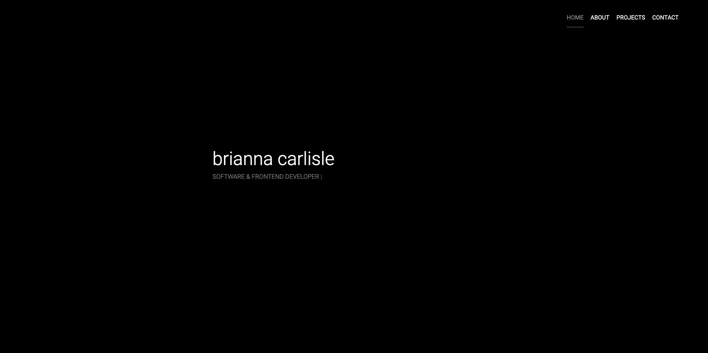
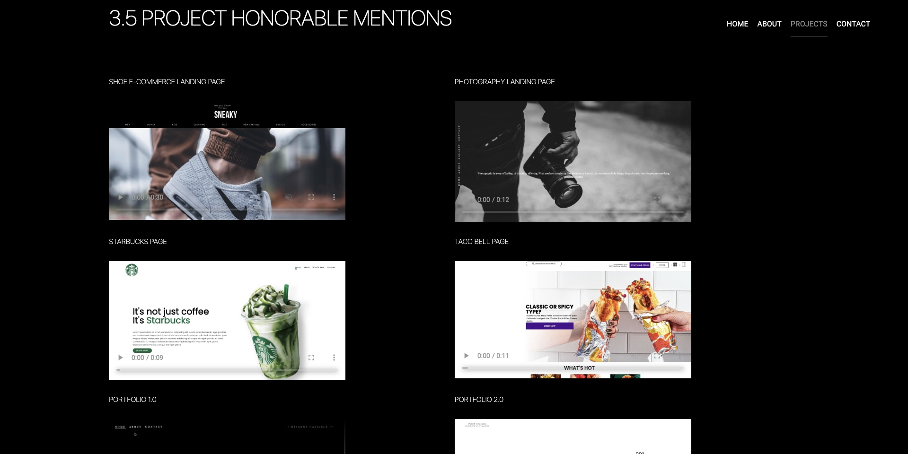

Portfolio Website

 

``HTML`` | ``CSS`` | ``JavaScript``

 

Key Features:

HTML, CSS, and JavaScript: This website is built using fundamental web technologies, including HTML for structure, CSS for styling, and JavaScript for interactivity. These technologies form the core foundation of modern web development.

Button Rotate Animations: One of the standout features of this portfolio website is the implementation of JavaScript-driven button rotate animations. This adds a dynamic and engaging element to the user experience, highlighting my proficiency in JavaScript and frontend development.

Minimalist Design: The website boasts a clean and minimalist design with a sleek black color scheme. This design choice not only enhances readability but also reflects my commitment to creating user-friendly interfaces that prioritize simplicity and elegance.

Why This Matters:

As a Software and Frontend Developer, I understand the importance of both technical competence and user-centered design. This portfolio website is a testament to my ability to combine these elements effectively.

The button animations demonstrate my creativity and flair for adding interactive elements to web projects, which can greatly enhance user engagement and satisfaction.

The minimalist design showcases my attention to detail and ability to create visually appealing and functional websites that align with modern design trends.

How to Use:

Simply visit the deployed website to explore my portfolio, view my projects, and learn more about my skills and experiences as a developer.
Conclusion:
My Software and Frontend Developer Portfolio Website is a showcase of my expertise in web development. Its use of HTML, CSS, and JavaScript, along with creative button animations and minimalist design, highlights my technical proficiency and commitment to creating user-friendly and aesthetically pleasing web experiences. Explore my portfolio and get to know me as a developer through this sleek and engaging website.

Explore the live website[ here](https://carlislebrianna.com/).
 
 
 

